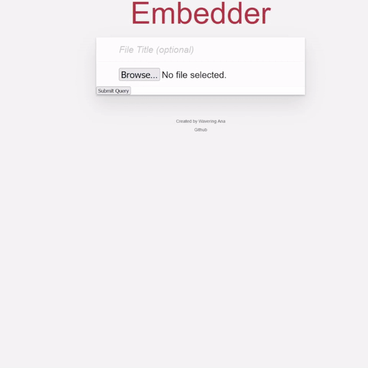

# Embedder

A media host specialized in good looking embeds for services like Discord. No file size limits. No compression.



Upcoming Features: 
* Smooth out mp4s similar to imgur and gfycat
* Guest user accounts
* ShareX support
* Re-enable uploading of any file server side, client side for non media, just provide a copyable link
* Expirey/auto-delete support


## Run

Source:
```Bash
EBPASS=changeme
EBPORT=4000
EBSECRET=4jkdmakl2l #jwt session secret

$ npm install
$ node db.js
$ npm start
```
Default username is admin with the password being whatever EBPASS is

Docker
```
docker run -d -p "4000:4000" -e EBPORT=4000 -e EBPASS=pass -e EBSECRET=4jkdmakl2l waveringana/embedder:latest
```

Docker Compose
```
version: '3.3'
services:
    embedder:
        ports:
            - '4000:4000'
        environment:
            - EBPORT=4000
            - EBPASS=changeme
            - EBSECRET=4jkdmakl2l
        volumes:
            - embedderdb:/var/db
            - embedderuploads:/uploads
        image: waveringana/embedder:latest
        network_mode: bridge
volumes:
    embedderdb:
    embedderuploads:
```

## License

[The Unlicense](https://opensource.org/licenses/unlicense)
